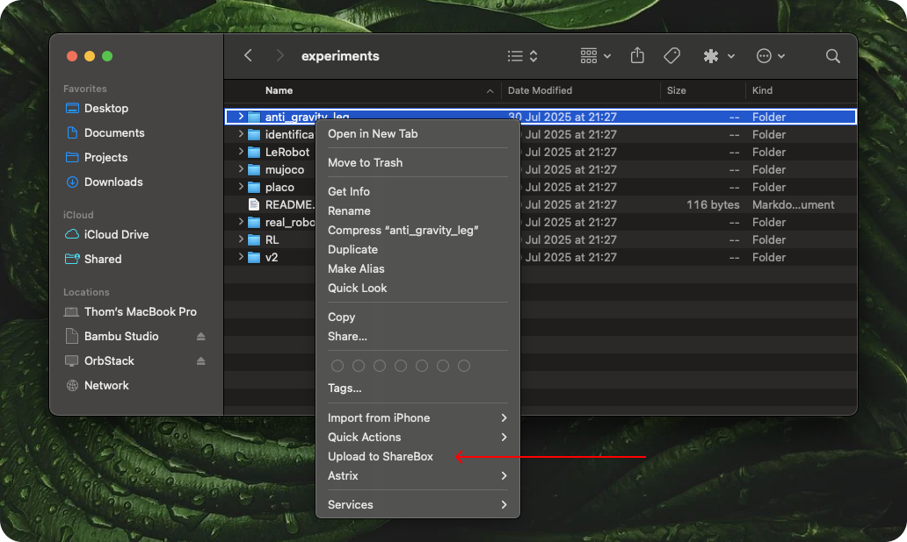
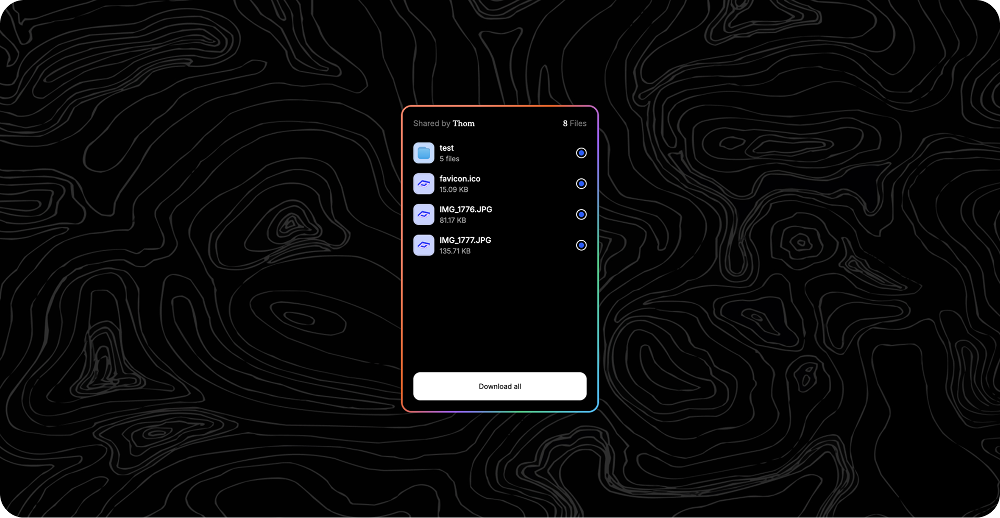

<!-- markdownlint-disable-next-line first-line-heading -->

Welcome to **ShareBox**! The easiest and quickest option for sharing files via the cloud. ShareBox will safely store files in your personal box in the cloud for you and your relatives to access.

## What does ShareBox do?

ShareBox is a macOS application that gives you the simple option to upload any file from Finder to the cloud. Just right-click a file and select **Upload to ShareBox**. This creates a new box with those files. After all the files are uploaded, they will become available for **48 hours** (configurable for up to a week in the settings) at a uniquely generated URL created just for you!

After the 48-hour (or otherwise configured) timeframe, your files and all traces will be **permanently** deleted.

## Getting Started 🔨

1. Download the latest version of ShareBox from the [releases page](https://github.com/thom1606/ShareBox/releases).
2. Open the DMG and install the app into your Applications folder.
3. Open the app and follow the onboarding steps.
4. Once the onboarding is complete, you can start sharing files.

## Features ✨

- Quickly create a box with your files.
- Share files with anyone, anywhere.
- Protect your boxes with a password.
- Choose how long your files should be available (24 hours, 48 hours, 3 days, 5 days, 7 days).
- Files are protected by pre-signed URLs.
- After a box expires, all traces are deleted.

## Feature Requests?

If you have any feature requests, don't hesitate to open an issue on the repository. I am always looking for ways to improve the project and support your needs.

## Current Limitations

At the moment, there are some small limitations I want you to know about. These limitations are being worked on, but some will take time to fine-tune (I'm hoping to increase limits further in the future).

1. There is a limit of 20 active boxes at a time. After you have created 20 boxes, you will have to wait for one to expire before you can continue.
2. Only 10 people can download from a box. If you would like more people to download your files, you should re-share those files.
3. Adding files to a box after creating one is not yet possible. This will be coming in the future.
4. Only files smaller than 5 GB can be uploaded for now. I'm looking into multi-part uploading, which will allow for much larger files; this is coming in the near future.

## Future Plans 🏅

ShareBox is still in active development, but it's already useful for quick and easy file sharing. That said, here are some features I'm currently planning or actively working on:

1. Multi-part upload. This will allow for much larger files to be uploaded (only the 250 GB cap from the subscription should become the limit).
2. Drag & drop files to create new boxes.
3. Adding files to the box that is currently being created (so you can select more files from different folders, etc.).
4. File previews for the download page (starting with images).
5. Pay-as-you-go subscription option. For users who need more than 250 GB per month, I want to help by giving the option to pay per GB after the initial 250 GB has been reached.
