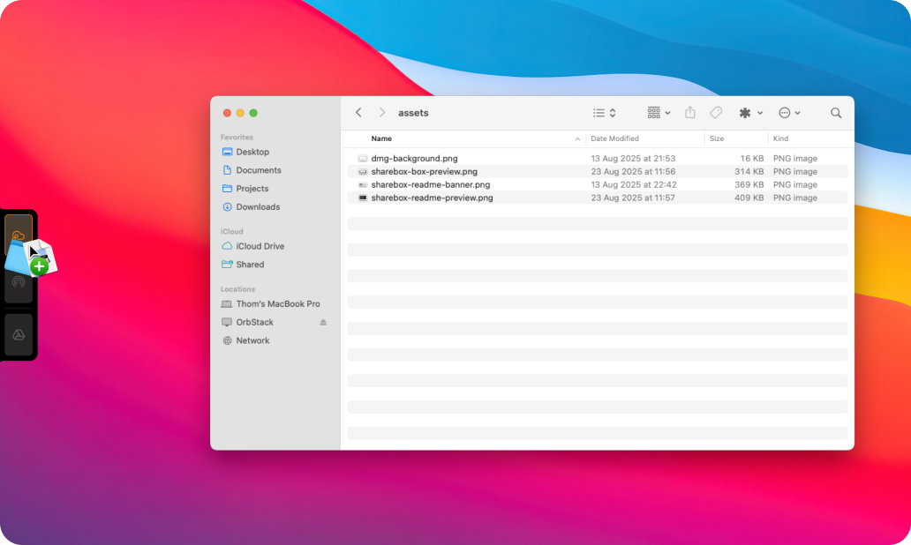
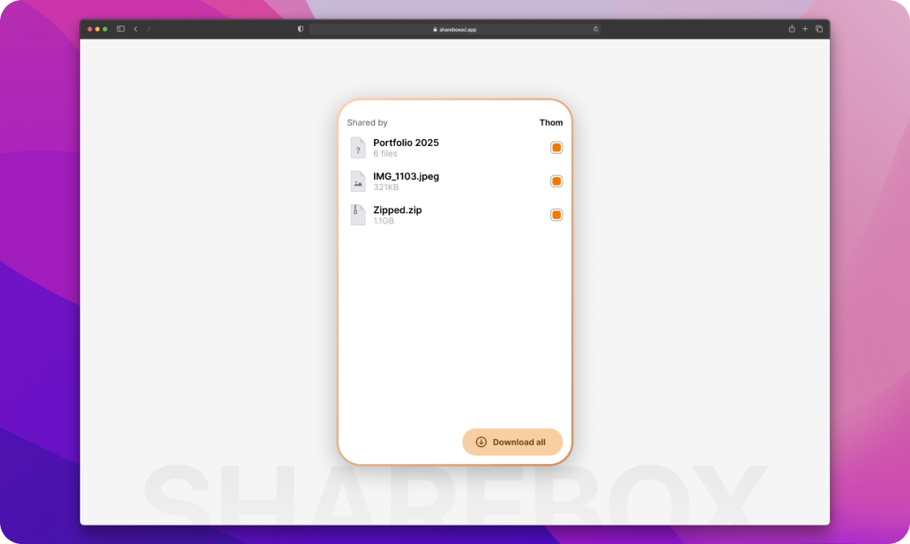

<!-- markdownlint-disable-next-line first-line-heading -->

Welcome to **ShareBox**! The easiest and quickest option for sharing files via the cloud. ShareBox will safely store files in your personal package in the cloud for you and your relatives to access.

## What does ShareBox do?

ShareBox is a macOS application that gives you the simple option to upload any file from Finder to the cloud. Just drag & drop files to the left side of you screen and start uploading. When dropping files, you get multiple options. Creating a ShareBox package for you to share fiels with others, airdrop or simply upload your files to a cloud drive of your liking.

## What are ShareBox Packages?

ShareBox Packages are small bundles of files you create when uploading files to ShareBox. After doing this, your package will become available for up to 14 days (configurable in the settings) for anyone you share the uniquely generated URL with.

After the expiry date, your package and all traces will be **permanently** deleted.

## Getting Started 🔨

1. Download the latest version of ShareBox from [shareboxed.app](https://shareboxed.app).
2. Open the DMG and install the app into your Applications folder.
3. Open the app and follow the onboarding steps.
4. Once the onboarding is complete, you can start sharing files.

## Features ✨

- Quickly create a package with your files.
- Share files with anyone, anywhere.
- Protect your packages with a password.
- Choose how long your files should be available (24 hours, 48 hours, 3 days, 5 days, 7 days, 2 weeks).
- Files are protected by pre-signed URLs.
- After a package expires, all traces are deleted.
- Upload files to your favorite cloud drive service (iCloud, Dropbox, OneDrive, Google Drive).
- **Airdrop** files easily.

## Feature Requests?

If you have any feature requests, don't hesitate to open an issue on the repository. I am always looking for ways to improve the project and support your needs.

## Current Limitations

At the moment, there are some small limitations I want you to know about. These limitations are being worked on, but some will take time to fine-tune (I'm hoping to increase limits further in the future).

1. There is a limit of 20 active packages at a time. After you have created 20 packages, you will have to wait for one to expire before you can continue.
2. Only 10 people can download from a package. If you would like more people to download your files, you should re-share those files.

## Future Plans 🏅

ShareBox is still in active development, but it's already useful for quick and easy file sharing. That said, here are some features I'm currently planning or actively working on:

1. ~~Multi-part upload. This will allow for much larger files to be uploaded (only the 250 GB cap from the subscription should become the limit).~~
2. ~~Drag & drop files to create new packages.~~
3. ~~Adding files to the package that is currently being created (so you can select more files from different folders, etc.).~~
4. File previews for the download page (starting with images).
5. ~~Pay-as-you-go subscription option. For users who need more than 250 GB per month, I want to help by giving the option to pay per GB after the initial 250 GB has been reached.~~
6. The ability to cancel an upload.
7. ~~Upload files to your favorite cloud drives.~~
